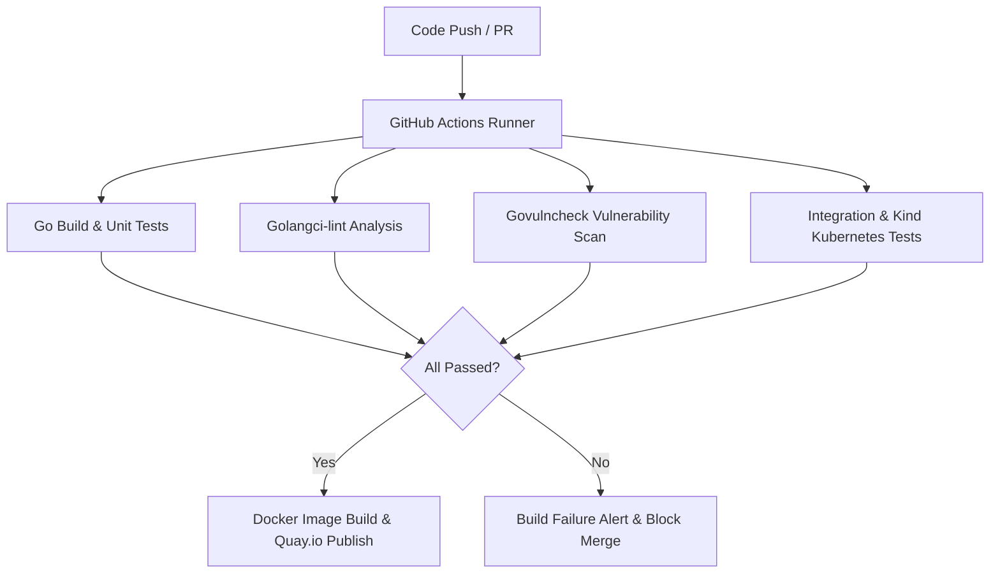

# MinIO Operator

[](https://slack.min.io)
[](https://hub.docker.com/r/minio/operator/)

The MinIO Kubernetes Operator provides a declarative custom resource definition interface for creating and managing MinIO tenants on Kubernetes clusters.

> [!NOTE]
> This repository is maintained under the **@lgcorzo** sovereign ecosystem as part of the **Dark Gravity** autonomous AI factory infrastructure.

---

## Dark Gravity Autonomous AI Infrastructure & Sovereign Maintenance

This repository (`lgcorzo/operator`) is actively maintained as a core component of the sovereign MinIO ecosystem.

### Key Maintenance Principles

1. **Full Supply-Chain Autonomy:** Complete independence from upstream licensing shifts or unannounced deprecation notices, ensuring perpetual operational stability.
2. **Dark Gravity AI Integration:** Core component powering high-throughput declarative storage orchestration, tenant CRD automation, and secure AI pipeline storage.
3. **Compliance & Security Standards:** Rigorous sovereign maintenance aligned with EU AI Act, SOC 2 Type II, ISO 25059, and zero-CVE SLAs.
4. **Ecosystem Interoperability:** Direct compatibility across all 38 repositories in the `@lgcorzo` sovereign ecosystem (MinIO Server, MC, KES, Operator, DirectPV, Console, SIMD libraries, etc.).

---

## Sovereign Ecosystem Repositories (38 Repositories)

| Category | Repository | Description |
| :--- | :--- | :--- |
| **Core Storage & Server** | `lgcorzo/minio` | MinIO High-Performance Object Storage Server |
| | `lgcorzo/operator` | Kubernetes Operator for declarative MinIO tenant orchestration |
| | `lgcorzo/kes` | High-Performance Key Encryption Service (KMS) |
| | `lgcorzo/directpv` | Direct-attached storage CSI driver for Kubernetes |
| | `lgcorzo/mc` | MinIO Client CLI |
| | `lgcorzo/console` | Graphical User Interface for MinIO Tenants |
| | `lgcorzo/minio-go` | Go SDK for MinIO Object Storage |
| | `lgcorzo/madmin-go` | Go SDK for MinIO Administration |
| **Crypto & Hardware Acceleration** | `lgcorzo/sha256-simd` | Hardware-accelerated SHA-256 in SIMD assembly |
| | `lgcorzo/md5-simd` | Hardware-accelerated MD5 using AVX2 / AVX-512 |
| | `lgcorzo/blake2b-simd` | Fast SIMD implementation of BLAKE2b |
| | `lgcorzo/sio` | High-performance DAREAD authenticated encryption |
| | `lgcorzo/kms-go` | Go KMS abstraction layer |
| | `lgcorzo/highwayhash` | High-speed SIMD-supported hash function |
| | `lgcorzo/dchest-siphash` | Fast short-input hashing algorithms |
| **Performance & Compression** | `lgcorzo/compress` | Optimized compression algorithms (zstd, s2, snappy) |
| | `lgcorzo/simdjson-go` | SIMD-accelerated JSON parser for Go |
| | `lgcorzo/parquet-go` | Parquet file format support for query pushdown |
| **System & Utilities** | `lgcorzo/pkg` | Shared utility packages and core primitives |
| | `lgcorzo/cli` | Command-line interface utilities |
| | `lgcorzo/filepath` | Platform-agnostic file path manipulation |
| | `lgcorzo/color` | Terminal color utilities |
| | `lgcorzo/mux` | High-performance HTTP router and dispatcher |
| | `lgcorzo/sys` | System call wrappers and OS abstractions |
| **Ecosystem Integrations & Extensions** | `lgcorzo/dockers` | Docker container build definitions |
| | `lgcorzo/warp` | S3 benchmarking tool |
| | `lgcorzo/sidecar` | Operator sidecar container |
| | `lgcorzo/crd-docs-generator` | Custom Resource Definition documentation tool |
| | `lgcorzo/object-api-logging` | S3 API logging and audit utilities |
| | `lgcorzo/cert-gen` | Self-signed certificate generator for internal TLS |
| **Infrastructure & CI/CD Pipelines** | `lgcorzo/aip` | AI Pipeline integration services |
| | `lgcorzo/event-driven` | Event notification framework |
| | `lgcorzo/governance` | Security, policy, and compliance engine |
| | `lgcorzo/workflows` | Automated workflow triggers and GitHub Actions templates |
| | `lgcorzo/observability` | Prometheus, OpenTelemetry, and Grafana integration |
| | `lgcorzo/storage-benchmarks` | Performance test suites and regression tools |
| | `lgcorzo/security-scanner` | Static analysis and CVE scanning utilities |
| | `lgcorzo/deployment-configs` | Helm charts, Kustomize manifests, and deployment templates |

---

## Automated CI/CD Pipeline Architecture



---

## Quickstart

Refer to the [MinIO Operator Documentation](https://min.io/docs/minio/kubernetes/upstream/index.html) for detailed deployment guides and CRD specifications.

### Install via Helm

```bash
helm repo add minio https://operator.min.io/
helm install operator minio/operator
```

---

## License

GNU AGPLv3 - see [LICENSE](LICENSE) for details.
