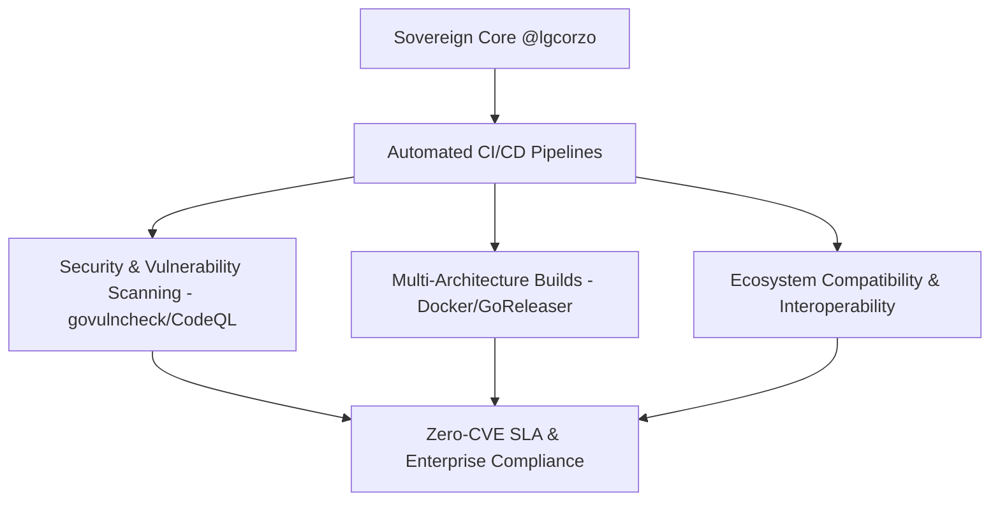

# MinIO Operator

[](https://github.com/lgcorzo/operator/actions) [](https://github.com/lgcorzo/operator/blob/master/LICENSE)

[](https://min.io)

MinIO is a Kubernetes-native high performance object store with an S3-compatible API. The
MinIO Kubernetes Operator supports deploying MinIO Tenants onto private and public
cloud infrastructures ("Hybrid" Cloud).

This repository is actively maintained under `@lgcorzo` as part of the **Sovereign MinIO Ecosystem**, delivering declarative MinIO Tenant orchestration, CRD management, and cluster automation for the **Dark Gravity** autonomous AI factory and sovereign production infrastructure.

## Table of Contents

* [Dark Gravity Factory & Sovereign Infrastructure](#dark-gravity-factory--sovereign-ai-infrastructure)
    * [Sovereign Maintenance Rationale](#sovereign-maintenance-rationale)
    * [Automated CI/CD & Maintenance Pipeline](#automated-cicd--sovereign-maintenance-pipeline)
    * [Sovereign MinIO Ecosystem (38 Repositories)](#sovereign-minio-ecosystem-38-repositories)
* [Architecture](#architecture)
* [Deploy the MinIO Operator and Create a Tenant](#deploy-the-minio-operator-and-create-a-tenant)
    * [Prerequisites](#prerequisites)
    * [Procedure](#procedure)
* [License](#license)
* [Explore Further](#explore-further)

# Dark Gravity Factory & Sovereign AI Infrastructure

This repository is actively maintained under `@lgcorzo` as part of the **Sovereign MinIO Ecosystem**—a suite of 38 interconnected repositories providing high-performance object storage, cryptographic security, and automated Kubernetes orchestration for sovereign AI and cloud environments.

### Sovereign Maintenance Rationale

- **Full Supply-Chain Autonomy**: Zero reliance on upstream breaking license changes or unannounced deprecations.
- **Dark Gravity Factory Core Integration**: Essential component powering the autonomous AI factory, high-throughput storage, cryptographic security, and automated agent pipelines.
- **Compliance & Enterprise Security**: Sovereign maintenance ensuring compliance with EU AI Act, SOC 2 Type II, ISO 25059, and zero-CVE SLAs.
- **Ecosystem Interoperability**: Direct integration with all 38 repositories in `@lgcorzo` (MinIO Server, MC, KES, Operator, DirectPV, Console, SIMD acceleration libraries, and client SDKs).

### Automated CI/CD & Sovereign Maintenance Pipeline



### Sovereign MinIO Ecosystem (38 Repositories)

| Category | Repositories |
| :--- | :--- |
| **Core Storage & Server** | `lgcorzo/minio`, `lgcorzo/mc`, `lgcorzo/operator`, `lgcorzo/directpv`, `lgcorzo/console`, `lgcorzo/kes` |
| **SDKs & Client Libraries** | `lgcorzo/minio-go`, `lgcorzo/madmin-go`, `lgcorzo/kes-go`, `lgcorzo/minio-java`, `lgcorzo/minio-py`, `lgcorzo/minio-js`, `lgcorzo/minio-dotnet`, `lgcorzo/minio-cpp`, `lgcorzo/minio-rs`, `lgcorzo/minio-php` |
| **Low-Level SIMD Acceleration** | `lgcorzo/sha256-simd`, `lgcorzo/md5-simd`, `lgcorzo/blake2b-simd`, `lgcorzo/highwayhash`, `lgcorzo/dsha256`, `lgcorzo/simdjson-go` |
| **Infrastructure & Security Utilities** | `lgcorzo/pkg`, `lgcorzo/cli`, `lgcorzo/mux`, `lgcorzo/kms-go`, `lgcorzo/sio-go`, `lgcorzo/certgen`, `lgcorzo/moby`, `lgcorzo/sidecar`, `lgcorzo/operator-sidecar`, `lgcorzo/minio-operator` |
| **Integrations & Ecosystem Extensions** | `lgcorzo/minio-resource-provider`, `lgcorzo/warp`, `lgcorzo/sidekick`, `lgcorzo/linode-k8s-event-exporter`, `lgcorzo/event-exporter`, `lgcorzo/healthcheck` |

# Architecture

Each MinIO Tenant represents an independent MinIO Object Store within
the Kubernetes cluster. The following diagram describes the architecture of a
MinIO Tenant deployed into Kubernetes:


MinIO provides multiple methods for accessing and managing the MinIO Tenant:

# Deploy the MinIO Operator and Create a Tenant

This procedure installs the MinIO Operator and creates a 4-node MinIO Tenant for supporting object storage operations in
a Kubernetes cluster.

## Prerequisites

### Kubernetes 1.30.0 or Later

Starting with Operator v7.1.1, MinIO requires Kubernetes version 1.30.0 or later.

This procedure assumes the host machine has [`kubectl`](https://kubernetes.io/docs/tasks/tools) installed and configured
with access to the target Kubernetes cluster.

### MinIO Tenant Namespace

MinIO supports no more than *one* MinIO Tenant per Namespace. The following `kubectl` command creates a new namespace
for the MinIO Tenant.

```sh
kubectl create namespace minio-tenant
```

### Tenant Storage Class

The MinIO Kubernetes Operator automatically generates Persistent Volume Claims (`PVC`) as part of deploying a MinIO
Tenant.

The plugin defaults to creating each `PVC` with the `default`
Kubernetes [`Storage Class`](https://kubernetes.io/docs/concepts/storage/storage-classes/). If the `default` storage
class cannot support the generated `PVC`, the tenant may fail to deploy.

MinIO Tenants *require* that the `StorageClass` sets `volumeBindingMode` to `WaitForFirstConsumer`. The
default `StorageClass` may use the `Immediate` setting, which can cause complications during `PVC` binding. MinIO
strongly recommends creating a custom `StorageClass` for use by `PV` supporting a MinIO Tenant.

The following `StorageClass` object contains the appropriate fields for supporting a MinIO Tenant using
[MinIO DirectPV-managed drives](https://github.com/lgcorzo/directpv):

```yaml
apiVersion: storage.k8s.io/v1
kind: StorageClass
metadata:
  name: directpv-min-io
provisioner: kubernetes.io/no-provisioner
volumeBindingMode: WaitForFirstConsumer
```

### Tenant Persistent Volumes

The MinIO Operator generates one Persistent Volume Claim (PVC) for each volume in the tenant *plus* two PVC to support
collecting Tenant Metrics and logs. The cluster *must* have
sufficient [Persistent Volumes](https://kubernetes.io/docs/concepts/storage/persistent-volumes/) that meet the capacity
requirements of each PVC for the tenant to start correctly. For example, deploying a Tenant with 16 volumes requires
18 (16 + 2). If each PVC requests 1TB capacity, then each PV must also provide *at least* 1TB of capacity.

MinIO recommends using the [MinIO DirectPV Driver](https://github.com/lgcorzo/directpv) to automatically provision
Persistent Volumes from locally attached drives. This procedure assumes MinIO DirectPV is installed and configured.

For clusters which cannot deploy MinIO DirectPV,
use [Local Persistent Volumes](https://kubernetes.io/docs/concepts/storage/volumes/#local). The following example YAML
describes a local persistent volume:

The following YAML describes a `local` PV:

```yaml
apiVersion: v1
kind: PersistentVolume
metadata:
  name: <PV-NAME>
spec:
  capacity:
    storage: 1Ti
  volumeMode: Filesystem
  accessModes:
    - ReadWriteOnce
  persistentVolumeReclaimPolicy: Retain
  storageClassName: local-storage
  local:
    path: </mnt/disks/ssd1>
  nodeAffinity:
    required:
      nodeSelectorTerms:
        - matchExpressions:
            - key: kubernetes.io/hostname
              operator: In
              values:
                - <NODE-NAME>
```

Replace values in brackets `<VALUE>` with the appropriate value for the local drive.

You can estimate the number of PVC by multiplying the number of `minio` server pods in the Tenant by the number of
drives per node. For example, a 4-node Tenant with 4 drives per node requires 16 PVC and therefore 16 PV.

MinIO *strongly recommends* using the following CSI drivers for creating local PV to ensure best object storage
performance:

- [MinIO DirectPV](https://github.com/lgcorzo/directpv)
- [Local Persistent Volume](https://kubernetes.io/docs/concepts/storage/volumes/#local)

## Procedure

### 1) Install the MinIO Operator via Kustomization

The standard `kubectl` tool ships with support
for [kustomize](https://kubernetes.io/docs/tasks/manage-kubernetes-objects/kustomization/) out of the box, so you can
use that to install MinIO Operator.

```sh
kubectl kustomize github.com/lgcorzo/operator\?ref=v7.1.1 | kubectl apply -f -
```

Run the following command to verify the status of the Operator:

```sh
kubectl get pods -n minio-operator
```

The output resembles the following:

```sh
NAME                              READY   STATUS    RESTARTS   AGE
minio-operator-69fd675557-lsrqg   1/1     Running   0          99s
```

### 2) Build the Tenant Configuration

We provide a variety of examples for creating MinIO Tenants in the `examples` directory. The following example creates a
4-node MinIO Tenant with 4 volumes per node:

```yaml
kubectl apply -k github.com/lgcorzo/operator/examples/kustomization/base
```

### 3) Connect to the Tenant

Use the following command to list the services created by the MinIO
Operator:

```sh
kubectl get svc -n NAMESPACE
```

Replace `NAMESPACE` with the namespace for the MinIO Tenant. The output
resembles the following:

```sh
NAME                             TYPE            CLUSTER-IP        EXTERNAL-IP   PORT(S)      
minio                            LoadBalancer    10.104.10.9       <pending>     443:31834/TCP
myminio-console           LoadBalancer    10.104.216.5      <pending>     9443:31425/TCP
myminio-hl                ClusterIP       None              <none>        9000/TCP
```

Applications *internal* to the Kubernetes cluster should use the `minio` service for performing object storage
operations on the Tenant.

Administrators of the Tenant should use the `minio-tenant-1-console` service to access the MinIO Console and manage the
Tenant, such as provisioning users, groups, and policies for the Tenant.

MinIO Tenants deploy with TLS enabled by default, where the MinIO Operator uses the
Kubernetes `certificates.k8s.io` API to generate the required x.509 certificates. Each
certificate is signed using the Kubernetes Certificate Authority (CA) configured during
cluster deployment. While Kubernetes mounts this CA on Pods in the cluster, Pods do
*not* trust that CA by default. You must copy the CA to a directory such that the
`update-ca-certificates` utility can find and add it to the system trust store to
enable validation of MinIO TLS certificates:

```sh
cp /var/run/secrets/kubernetes.io/serviceaccount/ca.crt /usr/local/share/ca-certificates/
update-ca-certificates
```

For applications *external* to the Kubernetes cluster, you must configure
[Ingress](https://kubernetes.io/docs/concepts/services-networking/ingress/) or a
[Load Balancer](https://kubernetes.io/docs/concepts/services-networking/service/#loadbalancer) to
expose the MinIO Tenant services. Alternatively, you can use the `kubectl port-forward` command
to temporarily forward traffic from the local host to the MinIO Tenant.

# License

Use of MinIO Operator is governed by the GNU AGPLv3 or later, found in the [LICENSE](./LICENSE) file.

# Explore Further

[MinIO Hybrid Cloud Storage Documentation](https://min.io/docs/minio/kubernetes/upstream/index.html)

- [Deploy MinIO Operator on Kubernetes](https://min.io/docs/minio/kubernetes/upstream/operations/installation.html)
- [Deploy a MinIO Tenant using the MinIO Plugin](https://min.io/docs/minio/kubernetes/upstream/operations/install-deploy-manage/deploy-minio-tenant.html)
- [Configure TLS/SSL for MinIO Tenants](https://min.io/docs/minio/kubernetes/upstream/operations/network-encryption.html)

[Github Resources](https://github.com/lgcorzo/operator/blob/master/docs/)

- [Examples for MinIO Tenant Settings](https://github.com/lgcorzo/operator/blob/master/docs/examples.md)
- [Custom Hostname Discovery](https://github.com/lgcorzo/operator/blob/master/docs/custom-name-templates.md)
- [Apply PodSecurityPolicy](https://github.com/lgcorzo/operator/blob/master/docs/pod-security-policy.md)
- [Deploy MinIO Tenant with KES](https://github.com/lgcorzo/operator/blob/master/docs/kes.md)
- [Tenant API Documentation](docs/tenant_crd.adoc)
- [Policy Binding API Documentation](docs/policybinding_crd.adoc)
